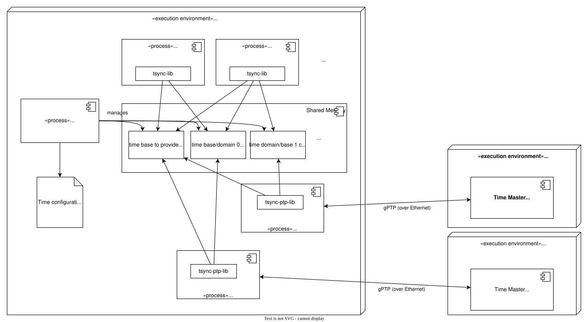

# Time Synchronization

Time Synchronization between different applications and/or ECUs is of paramount importance when correlation of different
events across a distributed system is needed, either to track such events in time or to trigger them at an accurate point
in time.

The Time-Synchronization (TSync) module is responsible for providing users with the functionality to retrieve time
information synchronized with other entities / ECUs.

## Project Structure

This C++ code implements the *Time Synchronization* module for S-CORE.
The folder structure is:

```plain
score-time
 ├── examples                tsync-lib usage examples
 ├── src
 |    ├── common             Common functionality used by "all" packages
 │    ├── flatbuffer         Flatbuffers mod for coverage(?)
 │    ├── flatcfg            Flatcfg implementation (to be moved to a common repo)
 │    ├── ptpd               Modified variant of ptpd
 │    ├── tsync-daemon       Daemon for managing tsync shared mem
 │    ├── tsync-lib          Library to be used by time clients
 │    ├── tsync-ptp-lib      Library used by ptpd
 │    └── tsync-utility-lib  Internal utility library for shared mem access
 ├── tests
      └── Binary/integration tests
```
Common sub-structure of each component (if applicable):
* Folder `include` contains the API definition of the component (i.e. its public headers).
* Folder `src` contains source files of the implementation and private headers.
* Folder `test` contains unit tests for the implemented classes.

## 🚀 Getting Started

### 1️⃣ Clone the Repository

```sh
git clone https://github.com/eclipse-score/inc_time.git
cd inc_time
```

## 2️⃣ Build

In order to build and run `ptpd`, install `libpcap`:

```shell
sudo apt-get install libpcap-dev
```

To build TSYNC, simply run Bazel:

```shell
bazel build //...
```
### 3️⃣ Run Tests

```sh
bazel test //tests/...
```

## 🛠 Usage

Run the timesync daemon:

```shell
export ECUCFG_ENV_VAR_ROOTFOLDER=$(pwd)/bazel-out/k8-fastbuild/bin/src/tsync-daemon/src/score/time/daemon/
bazel run //src/tsync-daemon:tsync_daemon
```

Run the ptp daemon:

```shell
sudo bazel run //src/ptpd -- -i <ethnernet-if> -d 1 --global:foreground=Y -S --ptpengine:transport=ethernet --ptpengine:delay_mechanism=DELAY_DISABLED --ptpengine:disable_bmca=y --score:globaltimepropagationdelay=0.0 -L --ptpengine:dot1as=1 --clock:no_adjust=Y
```

## High Level Design

The basic architecture/high level design of the S-CORE time related components is given in the following figure:

<figure>

<figcaption>
<b>Deployment</b>: This figure shows an exemplary deployment of the time sync related components.
</figcaption>
</figure>

* S-CORE time can handle multiple different time bases/time domains.
* Syncing of the "clocks" of those time bases between different devices/exeution environments is done via PTP over Ethernet
* A modified ptpd2 implementation is used to achive that on the S-CORE domain:
   * It syncs a time base with its belonging master clock
   * It stores the determined time offset between the time base and the local clock in a share memory area related to the time base
   * It does *not* sync the local clock time!
   * The modifications are done for supporting the AUTOSAR Time Synchronization Protocol
* Applications use the tsync-lib to get the current time of the desired time base. The tsync-lib
   * gets the time base's offset to the local clock from the respective shared memory ressource and
   * adds it to the current local clock value.
* The tsync-daemon is responsible to
   * manage the shared memory ressources of the different configured time bases
   * provide the time base configuration via shared memory to the applications and the ptpd2 process


## 📖 Documentation

- Feature: <https://eclipse-score.github.io/score/main/features/time/>
- Module Documentation: <https://eclipse-score.github.io/inc_time>
- Requirements: <https://eclipse-score.github.io/score/main/features/time/docs/requirements/>

---
